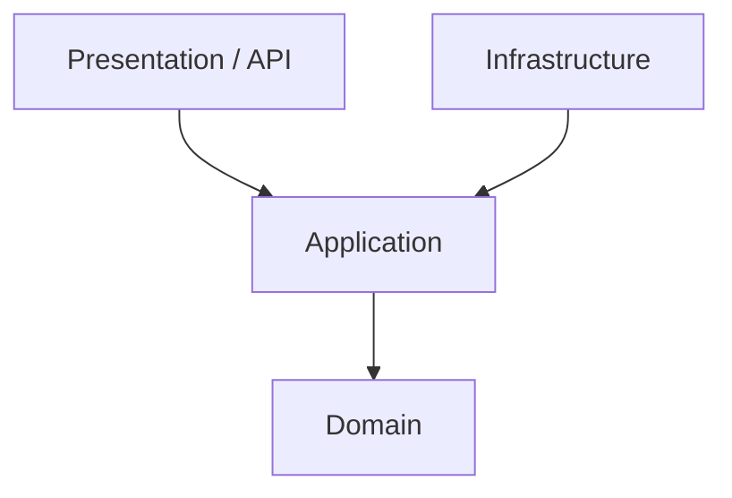

# 🚀 Enterprise Clean Architecture Starter Kit (.NET 9)


A production-ready, high-performance **Enterprise Clean Architecture** template built on **.NET 9**. Designed specifically to handle extreme scale scenarios (like Flash Sales/Thundering Herd) while maintaining strict architectural boundaries and world-class developer experience.

## ✨ Why this template?

Most Clean Architecture templates focus only on folder structures. This repository bridges the gap between theory and reality by implementing **production-critical enterprise patterns** right out of the box.

### 🔥 Enterprise-Grade Features

*   **⚡ Flash-Sale Ready (Optimistic Concurrency):** Implemented via PostgreSQL `xmin` hidden system columns, avoiding slow DB pessimistic locks and guaranteeing maximum throughput during high-traffic events (e.g., ticket booking).
*   **🏎️ CQRS with Dapper & EF Core:** Commands use Entity Framework Core for rich domain logic and change tracking, while Queries bypass EF entirely using raw Dapper SQL for blazing fast read operations without memory overhead.
*   **🛡️ Idempotency Guarantee:** Built-in `IdempotencyBehavior` backed by Redis ensures that network retries or double-clicks never result in double charges or duplicate data.
*   **🛡️ Thundering Herd Protection (Hybrid Caching):** Advanced `L1 (In-Memory) + L2 (Redis)` Hybrid Cache implementation with thread-safe prefix tracking to eliminate cache stampedes.
*   **📡 Real-time gRPC Streaming:** Built-in gRPC-Web support with thread-safe `ConcurrentDictionary` streaming to push live updates (like ticket availability) directly to React/Next.js clients.
*   **🚦 Rate Limiting:** Out-of-the-box Token Bucket API Rate Limiting to prevent bot abuse on hot paths.
*   **👁️ Full Observability (OpenTelemetry):** Zero-config distributed tracing and metrics exported directly to **Jaeger** and **Prometheus/Grafana**. 

---

## 🏗️ Architecture Overview

The system strictly follows Uncle Bob's Clean Architecture principles. Dependencies always point *inward*.



1.  **Domain Layer:** Enterprise logic, Entities, Domain Exceptions, Domain Events. (Zero external dependencies).
2.  **Application Layer:** Use Cases (CQRS via MediatR), FluentValidation, Pipeline Behaviors (Caching, Idempotency, Logging).
3.  **Infrastructure Layer:** EF Core, Dapper Connection Factory, Redis, Health Checks.
4.  **Api Layer:** Minimal APIs, gRPC Services, OpenTelemetry configuration, Exception Handling Middleware.

---

## 🚀 Getting Started

### Prerequisites
*   [.NET 9 SDK](https://dotnet.microsoft.com/download/dotnet/9.0)
*   [Docker Desktop](https://www.docker.com/products/docker-desktop)

### 1. Spin up the Enterprise Infrastructure
This project includes a fully configured `docker-compose.yml` that provisions the Database, Distributed Cache, and the complete Observability Stack.

```bash
docker-compose up -d
```
*This starts PostgreSQL, Redis, Jaeger, Prometheus, and Grafana.*

### 2. Run Database Migrations
Before running the API, apply the EF Core migrations to create your schema:

```bash
cd LongPd.CleanArchitecture.Api
dotnet ef database update --project ../LongPd.CleanArchitecture.Infrastructure
```

### 3. Start the API
```bash
dotnet run
```
Access the modern **Scalar API Documentation** at: `https://localhost:5001/scalar`

---

## 👁️ Enterprise Observability Setup

One of the highlights of this template is the **OpenTelemetry (OTel)** integration. Once the app receives traffic, you can monitor it like a Tech Lead:

### 📍 Distributed Tracing (Jaeger)
*   **URL:** `http://localhost:16686`
*   **What you see:** A Gantt chart of every request. See exactly how many milliseconds were spent in MediatR, Dapper queries, EF Core transactions, and Redis cache lookups.

### 📊 System Metrics (Grafana + Prometheus)
*   **URL:** `http://localhost:3000` (Login: `admin` / `admin`)
*   **What you see:** Real-time RAM/CPU usage, HTTP Request rates, Error rates (4xx/5xx), and database connection pool statuses.

---

## 🧠 Advanced Pipeline Behaviors (MediatR)

The `Application` layer utilizes a heavily customized MediatR pipeline:

1.  `IdempotencyBehavior`: Checks Redis to block duplicate `RequestId` executions.
2.  `LoggingBehavior`: Logs incoming requests and execution time.
3.  `ValidationBehavior`: Fails fast if FluentValidation rules are breached.
4.  `CachingBehavior`: Attempts to fetch read data from the Hybrid Cache before hitting the DB.
5.  `CacheInvalidationBehavior`: Automatically evicts stale cache entries when Write commands succeed.
6.  `Handler`: Executes the actual Business Logic.

---

## 🤝 Contributing
Contributions are always welcome! Feel free to open a Pull Request or create an Issue to discuss architectural enhancements.

## 📄 License
This project is licensed under the MIT License - see the LICENSE file for details. Let's build world-class software together.
